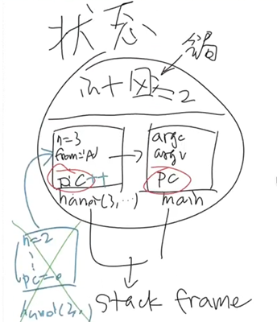

- [什么是程序](#什么是程序)
  - [两个视角下的状态机模型](#两个视角下的状态机模型)
  - [两个视角的转换](#两个视角的转换)
  - [理解操作系统的重要工具](#理解操作系统的重要工具)

code

[非递归实现汉诺塔：状态机的模拟](code/hanoi-nr.c)

# 什么是程序

程序是状态机

程序 = 计算 + syscall （这两个状态不断的转换）

## 两个视角下的状态机模型
两个视角
1. 源代码 Source (例子：C语言)
   - 状态 = 堆 + 栈
   - 初始状态 = main 的第一条语句
   - 迁移 = 执行一条简单语句
2. 二进制代码 Code (例子：汇编)
   - 状态 = 内存 M + 寄存器 R
   - 初始状态 = (计算机启动时发生的事)
   - 迁移 = 执行一条指令

C 程序停在某一语句时的状态图

## 两个视角的转换
用编译器 `C = compile(S)`

## 理解操作系统的重要工具
计算机系统建立在确定的机制上

剖析这些机制的工具如下：

`gcc, binutils, gdb, strace`