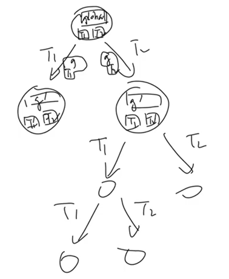
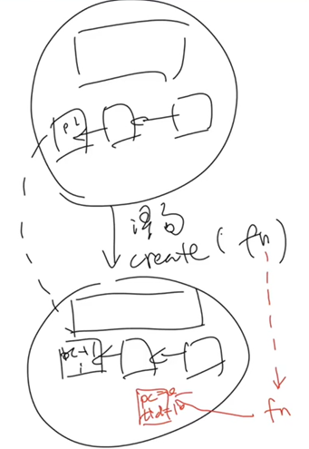
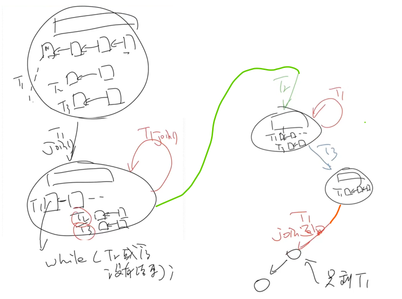

- [多处理器上的并发](#多处理器上的并发)
  - [并发的状态机模型](#并发的状态机模型)
  - [1. 模拟互斥行为，例子 sum.c](#1-模拟互斥行为例子-sumc)
  - [2. gcc](#2-gcc)
  - [3. 现代多处理器](#3-现代多处理器)

code

[多线程的模拟 thread.h](code/thread.h)
[线程栈帧属性的观测](code/stack-probe.c)
[mem-ordering 的观测](code/mem-ordering.c)
[peterson-simple](code/peterson-simple.c)
[peterson-barrier](code/peterson-barrier.c)

# 多处理器上的并发

- 并发程序 = 状态机
  - 线程共享内存
  - 每一步非确定选择线程执行
- 画状态机
  - 工具帮我画 ( model checker )
- 并发带来的问题
  1. 并发本身的特性导致的问题（ 在单/多处理器上，比如共享内存的问题 ）
  2. gcc 优化对并发线程行为的影响
  3. 现代多处理器优化对并发线程行为的影响


## 并发的状态机模型



`pthread_create`



`pthread_join`



函数作用导致的状态机模型变化详见 03 视频 20min

[上面两个函数的使用手册](https://zhuanlan.zhihu.com/p/97629526)


## 1. 模拟互斥行为，例子 sum.c

测试案例

```c
int main() {
  create(Tsum);
  create(Tsum);
  join();
  printf("sum = %ld\n", sum);
}
```

`Tsum` 的并发

```c
// 在单处理器多线程上完美运行

// 原因：处理器不会同时执行两个指令
// 解决：asm volatile 保证了对 sum 的访问不被调度算法中断

#define N 100000000

long sum = 0;

void Tsum() {
  for (int i = 0; i < N; i++) {
    asm volatile("addq $1, %0": "+m"(sum));
  }
}
```

```c
// 在多处理器多线程上完美运行

// 原因：多个处理器可能同时访问 sum
// 解决：一个线程访问 sum 时必须 lock(sum)

#define N 100000000

long sum = 0;

void Tsum() {
  for (int i = 0; i < N; i++) {
    asm volatile("lock addq $1, %0": "+m"(sum));
  }
}
```

## 2. gcc

编译器遵守 "eventually consistent"

即 线程内的某些内存访问会被编译器优化得面目全非

```c
while (!done);

// gcc -o2 选项
// would be optimized to

if (!done) 
{
  while (1);
}

// gcc 不考虑多线程的情况
// 在 gcc 看来 循环永远不会跳出循环
// 所以优化成这样减少对变量 done 的内存访问
// 导致顺序的丧失

// 导致就多线程并发进行时，包含该循环的线程永远阻塞在这里
```

解决办法

```c
// 增加这个语句告诉编译器 done 是多线程变量，可能被其他线程访问并改变
// 使得 gcc 不做上述优化
// 实现源代码的按顺序翻译
extern int volatile done;

while (!done) ;
```

```c
// 或者这样
extern int done;

while (!done)
{
  asm volatile(""::"memory"); //compiler barrier
}
```

## 3. 现代多处理器

类似于 gcc 编译器 对线程行为的修改

现代多处理器不再完全遵守 即时可见性

即 “乱序执行”、“按序提交”


```c
// 线程 T1 T2 并发

int x = 0, y = 0;

void T1() {
  x = 1;
  asm volatile("" : : "memory"); // compiler barrier
  printf("y = %d\n", y);
}

void T2() {
  y = 1;
  asm volatile("" : : "memory"); // compiler barrier
  printf("x = %d\n", x);
}
```

应该出现 `01 10 11` 的结果

但 `gcc -o2 mem-ordering.c -lpthrad` 的运行结果里面包含大量的 `00`

原因在于现代处理器也是（动态）编译器

```c
// 在 *循环* 中我们解决了 gcc 编译器优化带来的改变多线程程序行为问题
// 但这是 处理器 优化带来的改变多线程程序行为问题

// 如果 写x 发生 cache miss，可以让 读y 先执行
// 即 movl (y),%eax 优先执行
// 导致在另一个线程中 x = 0 被读入并打印

1. movl $1, (x)     
2. movl (y), %eax 
```

解决办法

```c
// write_x_read_y 函数中
// 插入语句 mefence
// 阻止处理器的优化策略

asm volatile(
    "movl $1, %0;" // y = 1
    // "mefence;"
    "movl %2, %1;" // x_val = x
    : "=m"(y), "=r"(x_val)
    : "m"(x));
```
