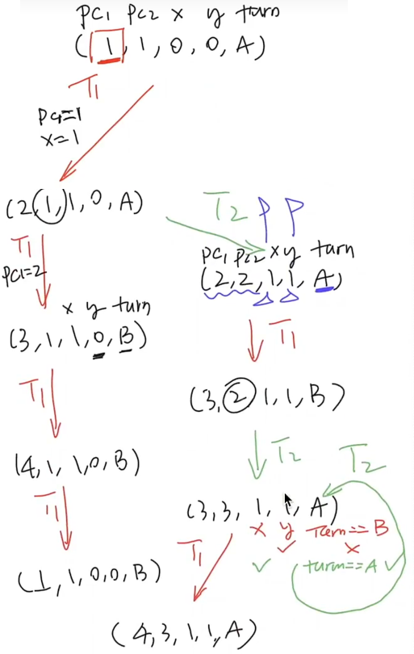
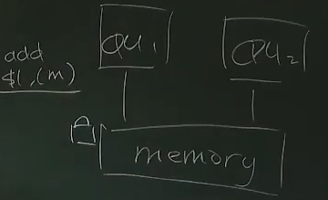
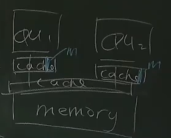

- [互斥的实现](#互斥的实现)
  - [Peterson's Protocol](#petersons-protocol)
      - [研究状态机模型重要思想](#研究状态机模型重要思想)
  - [原子指令](#原子指令)
      - [X86 系统](#x86-系统)
      - [RISC-V 系统](#risc-v-系统)
  - [自旋锁 SpinLock](#自旋锁-spinlock)
      - [代码](#代码)
      - [测试](#测试)
      - [缺陷和使用场景](#缺陷和使用场景)
  - [互斥锁 MutexLock](#互斥锁-mutexlock)
      - [协议](#协议)
      - [特点](#特点)
  - [Futex](#futex)

code

- [3 种锁的实现：验证 spinlock 的缺点等等](code/thread-sync.h)
  - [测试文件](code/sum-scalability.c)

# 互斥的实现

互斥 mutual exclusion

用来解决数据竞争导致的问题（与共享内存有关的问题）

## Peterson's Protocol

perterson 算法

不要原子指令实现互斥的方法

枚举状态机的全部状态 (假设没有乱序、每步执行一行)



在 Ubuntu 20.04 中 

`peterson-simple` 能正常运行一小会儿，原因还是在于我们的假设在现代处理器中不太成立

`peterson-barrier.c` 表现的性能更好


#### 研究状态机模型重要思想

算法的全部状态被抽象为一个 `有向图`

用一个 `BFS` 算法就可以从初始状态得到整个图

红色点代表同时进入临界区
绿色点代表 T1 在临界区
蓝色点代表 T2 在临界区

- Safety: 红色的状态不可到达
  - G(V,E) 上的可达性问题

- (Strong) Liveness: 从任意状态出发，都能到达绿/蓝色状态
  - G(V,E) 上的紧密连通单元问题 ( strongly conneted component ) 

## 原子指令

#### X86 系统

`x86` 系统的原子指令 `lock xxx` 的实现

==由硬件层一些线路设计决定的特性==

- 在一个 cpu 访存时，内存不会向其他 cpu 开放
- 多个 cpu 同时申请访存时，总线决定谁先访存



==在今天的 `x86` 体系结构中，出现的一些麻烦==

每个 cpu 都有自己独立的缓存

如果 cpu1 `lock(m)` 

但是 `m` 同时存在多个 cpu 的独立缓存中

我们就必须把 cpu2 独立缓存中的 `m` 剔除 

这花费巨大的代价



#### RISC-V 系统

原子操作的本质都是：

- load
- exec (处理器本地寄存器的运算)
- store

`RISC-V` 认为 `exec` 部分并不重要

所以它实现原子指令的基本思想：

1. 读内存 m，在 m 上标记 reserved，其他处理器写入 m 会导致标记消除
2. 本地操作 exec
3. 检查 reserved 
   - 标记未消失，则写入并清除标记
   - 标记消失，不写入

[RISC-V 原子指令 LR/SC 的介绍](https://tinylab.org/riscv-atomics/)


## 自旋锁 SpinLock

前提：

在硬件层实现了原子指令 

#### 代码

自旋的协议由代码体现

```c
/* 自旋锁 */

#define YES 0
#define NOPE 1

int table = YES;

int xchg(volatile int *addr, int newval);

void lock()
{
    int got;

retry:
    got = xchg(&table, NOPE); // 保证了拿放 table 时其他线程没有访问 table
    if (got == NOPE)
        goto retry;
    assert(got == YES);
}

void unlock()
{
    xchg(&table, YES);
}
```

```c
/* 自旋锁 -- 化简后 ( 与上面等价 ) */

int locked = 0;
void lock()
{
    while (xchg(&locked, 1))
        ;
}
void unlock() { xchg(&locked, 0); }
```

```c
// call 原子指令 lock xchg

int xchg(volatile int *addr, int newval)
{
    int result;
    asm volatile("lock xchg %0, %1"
                 : "+m"(*addr), "=a"(result)
                 : "1"(newval));
    return result;
}
```

#### 测试

```c
void Tsum()
{
  for (int i = 0; i < N; i++)
  {
    lock();
    sum++;
    unlock();
    
    // asm volatile("lock addq $1, %0"
    //              : "+m"(sum));
  }
}

int main()
{
  create(Tsum);
  create(Tsum);
  join();
  printf("%d", sum);
}

```

#### 缺陷和使用场景

缺陷

- 自旋会触发处理器间的缓存同步，延迟增加
- 除了获得自旋锁 （进入临界区）的线程，其他线程都在空转
- 而获得自旋锁的线程可能被操作系统切换出去

`sum-scalability.c` 对此进行了验证

使用场景：操作系统内核的并发数据结构 (短临界区)

- 临界区几乎不 “拥堵”
- 持有自旋锁时禁止执行流切换

自旋锁的使用在今天仍是一个很大的难题

## 互斥锁 MutexLock

实现 `线程 + 长临界区` 的互斥

#### 协议

把锁的实现放到操作系统里

- `syscall(SYSCALL_lock, &lock);`
  - 试图获得 lock，
    - 获取成功 `*lk = 🔒`，系统调用直接返回
    - 获取失败，该线程进入等待队列，再切换到其他线程
- `syscall(SYSCALL_unlock, &lock);`
  - 释放 lock
    - 等待队列不空，从等待队列中取出一个线程允许执行
    - 等待队列为空，`*lock = ✅`
- OS 使用自旋锁确保自己处理 lock 的过程是原子的

#### 特点

- 上锁失败线程不再占用 CPU
- 需要进出内核

## Futex

Fast Userspace muTexes

`Futex = Spin + Mutex`

1. 在用户空间自旋
   - 如果获得锁，直接进入
   - 未能获得锁，系统调用
2. 解锁以后也需要系统调用

```python
@thread
def t1(self):
    while True:
        if self.tryacquire() == '🔒':     # User
            self.waits = self.waits + '1' # Kernel
            while '1' in self.waits:      # Kernel
                pass
        cs = True                         # User
        del cs                            # User
        self.release()                    # Kernel
```