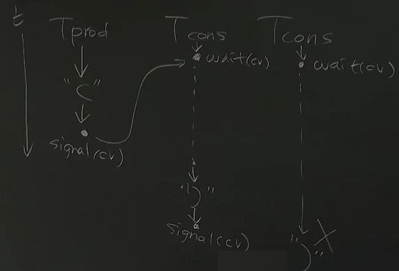

- [同步 Synchronization](#同步-synchronization)
  - [生产者-消费者问题](#生产者-消费者问题)
  - [引入条件变量](#引入条件变量)
      - [伪代码](#伪代码)
  - [引入信号量](#引入信号量)
      - [协议](#协议)
  - [哲学家吃饭问题](#哲学家吃饭问题)
      - [信号量的解决思路](#信号量的解决思路)
      - [分布式系统中常见的解决思路](#分布式系统中常见的解决思路)

code
- [测试](code/checkpc.c)
- [生产者-消费者问题](code/pc.c)
- [引入条件变量](code/pc-cv.c)
- [引入信号量](code/pc-sem.c)

# 同步 Synchronization

线程同步：在某个时间点共同达到互相已知的状态

<details>
  <summary>同步 Synchronization</summary>

  两个或两个以上随时间变化的量在变化过程中保持一定的相对关系

  - iCloud 同步 (手机 vs 电脑 vs 云端)
  - 同步电路 (所有触发器在边沿同时触发)
</details>

<details>
  <summary>异步 Asynchronous</summary>

  - 异步电路
</details>  

$\qquad$

本节回答的问题

- 如何在多处理器上==协同==多个线程完成任务
- 通过不断优化生产者-消费者问题的解法来引出这些协议

## 生产者-消费者问题

99% 的实际并发问题都可以用生产者-消费者解决

左括号：队列 < n 时才能打印
右括号：队列 > 0 时才能打印

伪代码

```c
void T()
{
  while (1)
  {
  retry:

    lock();

    if (condition != OK)
    {
      unlock(lk);
      goto retry;
    }

    临界区

    unlock(&lk);
  }
}
```

实现和测试：`pc.c checkpc.c`

## 引入条件变量

上一节的代码中，当 `condition != OK` 时

代码 `goto retry` ，为了判断同步而自旋，浪费了 CPU 资源

现在我们引入条件变量（Conditional Variables）解决该自旋问题

#### 伪代码

```c
void T()
{
  while(1)
  {
    lock();

    while(condition != OK)  /* 1. */
    {
      /* 下面这 3 条语句抽象为 1 条 wait 指令 */
      // unlock();
      // sleep();
      // lock();
      wait(self);
      /* 那 wait 一定要是原子指令才行吗？ */
    }

    临界区

    wakeup(other);             /* 2. */
    unlock();
  }
}
```

- 代码 ① `while` 保证了进入临界区时 `condition == OK`，如果换成 `if` 是不能保证的

- 代码 ② 调用 `broadcast(&cv)` 而不调用 `cond_signal(&cv)`，是为了避免如下情况。但有更好的方法比如引入两个条件变量



## 引入信号量

“信号量” (semaphore) = “一个资源”

某种意义上，信号量抽象了锁，并可以实现 n 种 m 把锁的同时存在

在 “单位资源” 明确的问题上更好用

#### 协议

- P(&sem) - prolaag = try + decrease; wait; down; in
  - 没有空位，等，直到有，空位--，函数返回
  - 有空位，空位--，函数立即返回
- V(&sem) - verhoog = increase; post; up; out
  - 资源++，函数返回

```c
/* 参数传入总位置 N */
/* fill 表示现存资源个数 f */
/* empty 表示空位个数 e */
/* f + e = N */
/* 某种意义上，相当于有两种锁 fill empty，每种锁都存在多个 */
/* 参数传入锁的类别，P 申请一把这种锁，V 释放一把这种锁  */

sem_t fill, empty;

SEM_INIT(&fill, 0);
SEM_INIT(&empty, N);

void producer()
{
  while (1)
  {
    P(&empty); // P V 是原子操作吗？
    printf("(");
    V(&fill);
  }
}

void consumer()
{
  while (1)
  {
    P(&fill);
    printf(")");
    V(&empty);
  }
}
```

完整实现 `pc-sem.c`

## 哲学家吃饭问题

#### 信号量的解决思路

```c
/* avail[lhs]：左边的叉子 avail[rhs]：右边的叉子 */

mutex_lock(&mutex);
while (!(avail[lhs] && avail[rhs])) {
  wait(&cv, &mutex);
}
avail[lhs] = avail[rhs] = false; // 第一次上锁且同步时，拿走叉子
mutex_unlock(&mutex);

临界区

mutex_lock(&mutex);
avail[lhs] = avail[rhs] = true; // 第二次上锁时，放下叉子
broadcast(&cv);
mutex_unlock(&mutex);
```

#### 分布式系统中常见的解决思路

多一个 waiter 线程来管理叉子，而不是让 philosopher 来自主分配

philosopher 的请求被 waiter 接受，waiter 进行分配

```c
void Tphilosopher(int id)
{
  send_request(id, EAT);
  P(allowed[id]);        // 返回时，philosopher 从 waiter 拿到叉子
  philosopher_eat();
  send_request(id, DONE);
}

void Twaiter()
{
  while (1)
  {
    (id, status) = receive_request();
    if (status == EAT)；
    if (status == DONE)；
  }
}
```

这个思路的性能分析

你可能会觉得，管叉子的人是性能瓶颈

- 一大桌人吃饭，每个人都叫服务员的感觉

但实际情况是（大部分情况）

- 吃饭的时间通常远远大于请求服务员的时间
- 如果一个 manager 搞不定，可以分多个 manager

分析一个算法的性能，应该结合它的实际作用点