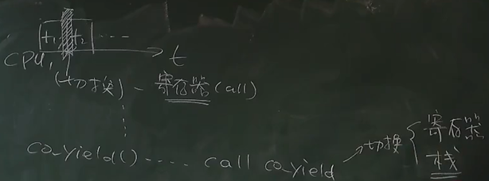
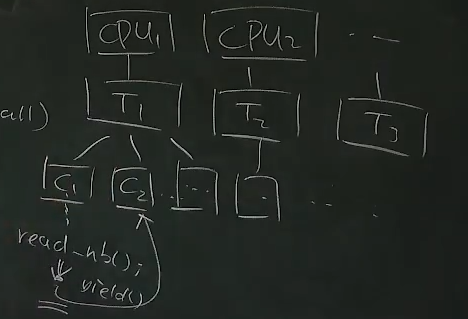

- [并发编程](#并发编程)
  - [把一个任务分配到多线程（任务分解）](#把一个任务分配到多线程任务分解)
  - [协程和线程提高并发效率（系统调用）](#协程和线程提高并发效率系统调用)
      - [例子：数据中心，go 的使用](#例子数据中心go-的使用)

# 并发编程

本节回答的问题

- 什么样的任务是需要并发的？
- 它们应该如何实现？

## 把一个任务分配到多线程（任务分解）

步骤

- 计算任务如何分解
- 线程间如何通信

如

```c
// 多线程对 Ｗ＊Ｈ　的函数赋值
// 这个例子甚至没有锁，没有线程访问共享内存

void Tworker(int tid)
{
  for (int i = 0; i < W; i++)
    for (int j = 0; j < H; j++)
      if (belongs(i, j, tid - 1))
      {
        do_its_job();
      }
}
```

## 协程和线程提高并发效率（系统调用）

如何用好一台计算机的资源？

多个线程可以同时在多个处理器上同时运行（优点）

但多个线程在一个 CPU 上的切换代价大（缺点）
- 保存所有寄存器
- 在内核做些事情，调度下一个线程

所以引入协程在一个 CPU 上做切换（类似函数的调用）
- 只保存即将被覆盖的寄存器到栈
- 不进内核



#### 例子：数据中心，go 的使用

场景：同一时间有数千/数万个请求到达服务器

计算部分
- 利用好多处理器
  - 线程 → 多个线程在多个处理器上同时运行

I/O 部分
- 会在系统调用上阻塞 (例如请求另一个服务或读磁盘)
  - 协程 → 阻塞一个协程，切换到另一个协程，直到阻塞结束才会切换回来

Goroutine 的模型

- 