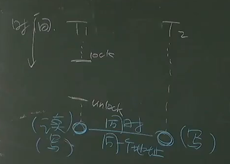

- [并发 bug](#并发-bug)
  - [定位 Bug 的通用方法：防御性编程](#定位-bug-的通用方法防御性编程)
  - [AV](#av)
      - [数据竞争 Data Race](#数据竞争-data-race)
  - [OV](#ov)
  - [死锁 Deadlock](#死锁-deadlock)
      - [AA-Deadlock](#aa-deadlock)
      - [ABBA-Deadlock](#abba-deadlock)
      - [解决思路](#解决思路)
  - [定位 Bug 的方法](#定位-bug-的方法)
      - [Lockdep 规约](#lockdep-规约)
      - [ThreadSanitizer](#threadsanitizer)
      - [已有的动态分析工具：Sanitizers](#已有的动态分析工具sanitizers)
      - [简单编程](#简单编程)

# 并发 bug

本次课主要内容

- 并发 bug：死锁和数据竞争
- 应对的方法

> 97% 的非死锁并发 bug 都是 AV 或 OV
> 
> 忘记上锁——原子性违反 ( Atomicity Violation, AV )
> 忘记同步——顺序违反 ( Order Violation, OV )


## 定位 Bug 的通用方法：防御性编程

防御性编程：加 `assert()`

> bug 出现原因：软件是需求在计算机数字世界的投影


## AV

多处理器并发下出现==数据竞争==的现象，可能违反原子性，导致 bug

解决思路：用锁保护好共享数据（ 见 `05 互斥.md`：锁的实现 ）

#### 数据竞争 Data Race

定义：不同的线程同时访问同一段内存，且至少有一个是写




## OV

多处理器上协同多个线程完成任务时，可能违反顺序，导致 bug

解决思路：用比如条件变量进行同步（ 见 `06 同步.md` ）

## 死锁 Deadlock

由锁引起的 bug

出现线程 “互相等待” 的情况

#### AA-Deadlock

```c
// 上锁关中断，开锁开中断
// 执行 spin_unlock(&xxx) 后中断打开
// 此时可以跳到函数 on_interrupt()
// 而 on_interrupt() 要求 spin_lock(&list_lock)
// 自此自锁产生

void os_run() {
  spin_lock(&list_lock);
  spin_lock(&xxx);
  spin_unlock(&xxx); // ---------+
}                          //    |
                           //    |
void on_interrupt() {      //    |
  spin_lock(&list_lock);   // <--+
  spin_unlock(&list_lock);
}
```

#### ABBA-Deadlock

```c
void swap(int i, int j) {
  spin_lock(&lock[i]);
  spin_lock(&lock[j]);

  ...

  spin_unlock(&lock[j]);
  spin_unlock(&lock[i]);
}

```

三个线程 `swap(1, 2); swap(2, 3); swap(3, 1);` 同时运行时

T1 拿到 `lock[1]`，T2 拿到 `lock[2]`，T3 拿到 `lock[3]`，死锁产生

#### 解决思路
AA-Deadlock

- AA 型的死锁容易检测，及早报告，及早修复
- `spinlock-xv6.c` 中的各种防御性编程
  - `if (holding(lk)) panic();`

ABBA-Deadlock

- 任意时刻系统中的锁都是有限的
- 严格按照固定的顺序获得所有锁 ( ==lock ordering== )
  -  如：T1: A -> B -> C; T2: B -> C 是安全的

## 定位 Bug 的方法

bug 出现时，定位 bug 的办法

#### Lockdep 规约

针对死锁

- 为每一个锁确定唯一的标识符 x , y
- 记录所有观察到的上锁顺序
- 检查是否存在 x⇝y ∧ y⇝x（哪一步违反了 lock ordering）

本质上是一个有向图

x , y 为点

上锁循序为边

当出现了环路，就出现了 bug

#### ThreadSanitizer

针对数据竞争

- 为所有事件建立 happens-before 关系图（传递闭包）
- 对于发生在不同线程且至少有一个是写的 x , y 检查
  - 点到点之间没有路径是数据竞争

访存事件为点，时间为有向边

#### 已有的动态分析工具：Sanitizers

- AddressSanitizer (asan) : 非法内存访问
  - Buffer overflow, use-after-free, use-after-return, double-free,
- ThreadSanitizer (tsan) : 数据竞争
- MemorySanitizer (msan) : 未初始化的读取
- UBSanitizer (ubsan) : undefined behavior

C 语言中，加入编译选项

`fsanitizer=address`

`fsanitizer=thread` 等

本质上就是防御性编程

行为类似在你代码中插入 `assert()`

#### 简单编程

- Canary 保护栈空间

```c
// Canary
// “牺牲” 一些内存单元，来预警 memory error 的发生
// 在栈的顶和底都设置一些特殊的数字
// 每隔一段时间检查一下是否被修改，以此确定是否溢出

#define MAGIC 0x55555555
#define BOTTOM (STK_SZ / sizeof(u32) - 1)
struct stack
{
    char data[STK_SZ];
};

void canary_init(struct stack *s)
{
    u32 *ptr = (u32 *)s;
    for (int i = 0; i < CANARY_SZ; i++)
        ptr[BOTTOM - i] = ptr[i] = MAGIC;
}

void canary_check(struct stack *s)
{
    u32 *ptr = (u32 *)s;
    for (int i = 0; i < CANARY_SZ; i++)
    {
        panic_on(ptr[BOTTOM - i] != MAGIC, "underflow");
        panic_on(ptr[i] != MAGIC, "overflow");
    }
}
```

- 内存分配

```c
// allocation
for (int i = 0; (i + 1) * sizeof(u32) <= size; i++)
{
    // 给待分配的内存标记为 MAGIC
    // 如果在标记前就是 MAGIC，报告 double-allocation */
    panic_on(((u32 *)ptr)[i] == MAGIC, "double-allocation");
    arr[i] = MAGIC;
}

// free
for (int i = 0; (i + 1) * sizeof(u32) <= alloc_size(ptr); i++)
{
    panic_on(((u32 *)ptr)[i] == 0, "double-free");
    arr[i] = 0;
}
```

- 低配版 Lockdep

```c
// 统计当前的 spin count
// 如果超过某个明显不正常的数值 ( 比如 1,000,000,000 ) 就报告

int spin_cnt = 0;

while (xchg(&locked, 1))
{
    if (spin_cnt++ > SPIN_LIMIT)
    {
        printf("Too many spin @ %s:%d\n", __FILE__, __LINE__);
    }
}
```