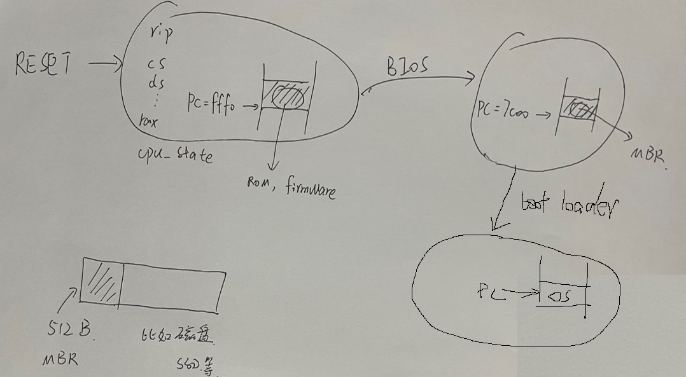
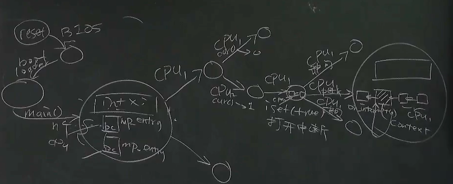

- [操作系统的状态机模型](#操作系统的状态机模型)
  - [计算机启动时发生的事](#计算机启动时发生的事)
      - [调试 QEMU: 确认 Firmware 的行为](#调试-qemu-确认-firmware-的行为)
  - [OS 载入后](#os-载入后)

# 操作系统的状态机模型

本次课主要内容

- 软件和硬件的桥梁
- 操作系统的加载和初始化
- AbstractMachine 代码导读

## 计算机启动时发生的事

计算机启动时，状态机进行 RESET 进入一个确定的状态

- 设定一些重要的寄存器的值
- PC 指向一块 ROM（X86-64上，PC = 0xffff0，见它的手册）
- 等等

其中，PC 指向的 ROM 又叫做 Firmware （计算机启动时运行的第一个程序）

假设 Firware 实现了 BIOS（拿 Legacy BIOS 举例）

<!-- 扫描所有硬件，找到有操作系统的硬件，把操作系统加载到内存 -->
运行这段程序，扫描所有硬件

把第一个可引导设备的第一个扇区（MBR）加载到物理内存的 0x7c00 位置

- 处理器处于 16-bit 模式
- 成功时 PC = 0x7c00

有了这 512K 的代码，把它叫作 boot loader，它可以是好几级的

在它的作用下，操作系统被加载到内存，PC指向这块内存，接管系统

Firmware 和 boot loader 共同完成 “操作系统的加载”
- 初始化全局变量和栈；分配堆区 (heap)
- 为 main 函数传递参数

> 今天的 Firmware: UEFI

#### 调试 QEMU: 确认 Firmware 的行为

- 查看 CPU Reset 后的寄存器
  - `info registers`
- 查看 0x7c00 内存的加载
  - `watch *0x7c00` - 《计算机系统基础》的良苦用心
  - 查看当前指令 `x/i ($cs * 16 + $rip)`
  - 打印内存 `x/16xb 0x7c00`
- 进入 0x7c00 代码的执行
  - `b *0x7c00, c`

见视频 45min

## OS 载入后

卡在视频 1h05min

我个人跑thread-os.c的文件的方法是：

clone am-kernels和abstract-machines仓库（这两个仓库要放在同一路径下）

然后读abstract-machines的makefile以及am-kernels/kernel/thread-os文件夹的makefile，最后填充完abstract-machine里未实现的库函数后根据makefile的指示编译运行。

视频里的那几个gdb脚本我没有设置，应该是老师自己改的。

老师未公开thread-os配置源码的原因可能是老师不想泄露abstract-machine里面那些库函数代码的实现结果吧

[南京大学 计算机科学与技术系 计算机系统基础 课程实验 2021](https://nju-projectn.github.io/ics-pa-gitbook/ics2021/)

