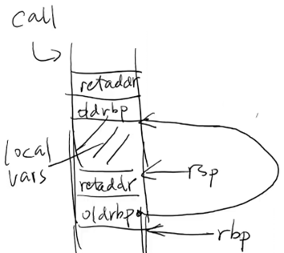

- [可执行文件的一生](#可执行文件的一生)
  - [操作系统上的可执行文件](#操作系统上的可执行文件)
  - [解析可执行文件](#解析可执行文件)
  - [静态链接](#静态链接)
      - [编译和链接](#编译和链接)
      - [静态 ELF 加载器：实现](#静态-elf-加载器实现)
  - [动态链接](#动态链接)

---

[link 过程的详细记录](./link.md) 

# 可执行文件的一生

描述（状态机的初始状态 + 迁移）的数据结构

## 操作系统上的可执行文件

需要满足若干条件

- 具有 `x` 权限
- 加载器能识别的可执行文件

```bash
// 测试

$ ./a.c
bash: ./a.c: Permission denied

$ chmod +x a.c && ./a.c
exec: Exec format error

$ chmod -x a.out && ./a.out
bash: ./a.out: Permission denied
```

通过 `strace ./a.c` 发现，是 `execve()` 返回 `-1`

阅读 execve (2) 的手册 ERRORS 部分

> UNIX/Linux 中的常见可执行文件
> 
> - a.out (deprecated)
> - ELF (Executable Linkable Format)
> - She-bang

## 解析可执行文件

使用 [GNU binutils](https://www.gnu.org/software/binutils/) （- Binary Utilities） hack 运行时的状态

这一切实现基于 [The DWARF Debugging Standard]()

- 定义了一个 Turing Complete 的指令集 DW_OP_XXX
- 可以执行 “任意计算” 将当前机器状态映射回 C

但非常不完美

- 对现代语言支持有限 (C++ templates)
  - 还是因为编程语言太复杂了
- 编译器也没法保证就做得对
  - 各种令人生气的 <optimized out>
  - 各种不正确的调试信息

例子：[Stack Unwinding](./code/unwind.c)

- `-g` (生成调试信息)
- `-static` (静态链接)
- `-fno-omit-frame-pointer` (总是生成 frame pointer)
- 可以尝试不同的 optimization level，再试试 `gdb`

```c
// 每个函数前 3 句汇编

endbr64
push %rbp
mov %rsp,%rbp
```



这样我们可以追踪到每个返回地址，然后用 `addr2line` 命令打印出对应的 c 源码位置

一个情况是，用 `O2` 优化后，打印结果跟不优化不一样

结论：Still open (这个领域有很多工作可以做)

> `nm` - list symbols from object files
> `readelf` - display information about ELF files

## 静态链接

#### 编译和链接

[重新理解编译、链接流程]()

1. 编译器 (gcc)
   - `High-level semantics` (C 状态机) → `low-level semantics` (汇编)

2. 汇编器 (as)
   - `Low-level semantics` → `Binary semantics` (状态机容器)
     - “一一对应” 地翻译成二进制代码
       - sections, symbols, debug info
     - 不能决定的信息，如 `callq xxx`
       - relocations

3. 链接器 (ld)
   - 合并所有 `Binary semantics`，得到 “一个完整的状态机”

[重定位]()

- 准备两个文件

    ```c
    // main.c
    void hello();

    int main() {
    hello();
    }
    ```

    ```c
    // hello.c
    #include <stdio.h>

    void hello() {
    printf("Hello World\n");
    }
    ```

- `objdump -d main.o`

    ```
    //
    0000000000000000 <main>:
    a:   e8 00 00 00 00      callq  ????????
    f:   31 c0               xor    %eax,%eax
    ```

- 重定位 (relocation)

    ```c
    // 上段汇编中 e8 00 00 00 00
    // 4 个 00 会在最后的链接中被填为 offset
    // int32_t offset = *(int32_t *)((uintptr_t)main + 0xb)

    (char *)hello ==
        (char *)main + 0xf + // call hello 的 next PC
        *(int32_t *)((uintptr_t)main + 0xb) // call 指令中的 offset
    ```

[ELF 的细节]()

- ELF 就是一个 “容器数据结构”，包含了上述转换中必要的信息

    ```c
    struct executable {
    uint32_t entry;
    struct segment *segments;
    struct reloc *relocs;
    struct symbol *symbols;
    };
    struct segment { uint32_t flags, size; char data[0]; }
    struct reloc   { uint32_t S, A, P; char name[32]; };
    struct symbol  { uint32_t off; char name[32]; };
    ```

#### 静态 ELF 加载器：实现

[loader-static.c](loader-static.c)

- 解析 elf 中的数据结构，按规定映射到内存
  - RTFM: `/usr/include/elf.h`
- 创建进程运行时初始状态，如 `argv, envp, ...`
  - RTFM: [System V ABI Figure](https://jyywiki.cn/pages/OS/manuals/sysv-abi.pdf) 3.9 (Initial Process Stack)
- 跳转

> 加载操作系统内核跟加载普通程序并无本质上的区别
> 它也是一个 ELF 文件 ( 解析 + 复制 + 跳转 )
> 只是加载普通程序用 mmap
> 加载内核要调用硬件的接口，让磁盘帮我们直接搬数据

## 动态链接

[优势]()

- 减少库函数的磁盘和内存拷贝
- 大型项目的分解

[一个 “最直观” 的动态链接格式]()

- 假设编译器可以为你生成位置无关代码 (PIC)

  ```s
  DL_HEAD

    LOAD("libc.dl") # 加载动态库
    IMPORT(putchar) # 加载外部符号
    EXPORT(hello)   # 为动态库导出符号

  DL_CODE

    hello:
      ...
      call DSYM(putchar) # 动态链接符号
      ...

  DL_END
  ```

[解决 dl 文件的设计缺陷]()

重要的缺陷

- DSYM 是间接内存访问 
  - `#define DSYM(sym)   *sym(%rip)`

处理方式

- 来自其他编译单元 (静态链接)
  - 直接 PC 相对跳转即可
- 动态链接库
  - 必须查表 (编译时不能决定)

由此诞生 `GOT & PLT`

> 其他一些特性
> 
> - 允许将 `.dl` 中的一部分以某个指定的权限映射到内存的某个位置
> - 字符串存储在常量池，统一通过 “指针” 访问
>   - 这是带来 ELF 文件难读的最根本原因
> - 其他