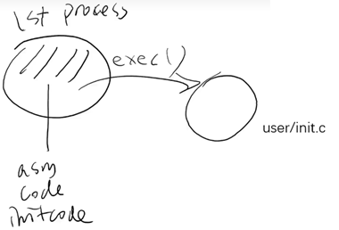
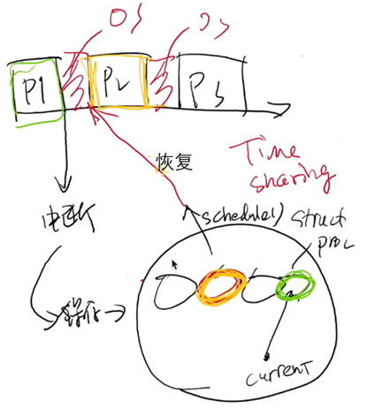
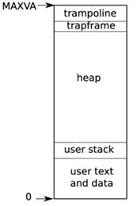

- [xv6 代码导读](#xv6-代码导读)
  - [项目构建与运行](#项目构建与运行)
  - [Initcode](#initcode)
  - [Trap](#trap)
      - [回顾：程序的状态](#回顾程序的状态)
      - [ecall 指令](#ecall-指令)
      - [trampoline.S 状态的封存](#trampolines-状态的封存)
      - [usertrap() 后的系统状态](#usertrap-后的系统状态)

参考

- [mit 6S081 Makefile解读](https://www.bilibili.com/video/BV1gf4y1P7GX/?spm_id_from=333.788&vd_source=454e9c56dd1d2d25131e921b939a8d39)
- [从零开始使用 Vscode 调试 XV6](https://zhuanlan.zhihu.com/p/501901665)

# xv6 代码导读

RTFM

- [xv6: A simple, Unix-like teaching operating system](https://jyywiki.cn/pages/OS/manuals/xv6-riscv-rev2.pdf)
  - 宝藏手册，包含了所有细节和 “为什么要这么做”，推荐阅读

RTFSC

- [src: xv6-riscv](https://github.com/mit-pdos/xv6-riscv)
  - `git clone`

## 项目构建与运行

RTFSC: Makefile

- 找到构建目标 `qemu`
- 然后 `make -nB qemu`
- 然后 `make qemu --debug=b`

配制 vscode

- `bear make qemu` 自动生成 `compile_commands.json`

调试

1. `gdb`
2. `make qemu-gdb`

其他环境工具安装见参考

## Initcode

第一个进程 `initcode[]`

- `user/initcode.asm`
- `riscv64-linux-gnu-gcc-objdump -d initcode.out`，`part <start>`

`kernel/main.c main() -> kernel/proc.c userinit() -> uvmfirst()`

gdb 

- `b 0x0000`
- `x/10i 0x0000`

## Trap

ecall → invariant (状态机被封存) → schedule → sret

#### 回顾：程序的状态

1. 寄存器：32 个通用寄存器 + `$pc`

2. 内存：`$satp` “配置” 出的地址空间

   - QEMU: `info mem` 查看

3. 持有的操作系统对象：程序只能看见 “文件描述符” （ 系统调用返回值 ）

xv6 进程的地址空间如下

- `trampoline` 是所有进程共享一份
- `trapframe` 是每个进程都有自己的一份

#### ecall 指令

1. 关中断
2. copy `$pc` to `$sepc`
3. 更改权限的其他的一些设置
4. copy `$stvec` to `$pc`

详见 [xv6: A simple, Unix-like teaching operating system](https://jyywiki.cn/pages/OS/manuals/xv6-riscv-rev2.pdf)

> `$stvec` 保存了 `trampoline` 的地址 (S-mode trap vector)
> `$sscratch` 保存了进程的 `trapframe` 地址 (S-mode sscratch)
> `$satp` (S-mode address translation and protection)

#### trampoline.S 状态的封存

after `ecall`

1. 此时 `$pc` 指向 `trampoline.S`

2. 对 `ecall` 瞬间的状态做快照，保存进程寄存器现场到 `struct trapframe (proc.h)`

3. 最后 `jump to usertrap()`

“状态的恢复” 就是上述的逆操作

#### usertrap() 后的系统状态

os 维护着一组 `struct proc (proc.h)`，其中 `struct trapframe` 就存在于 proc 中

此时的 os 可以 ”为所欲为“

- 修改任何一个状态机
- 状态机调度 