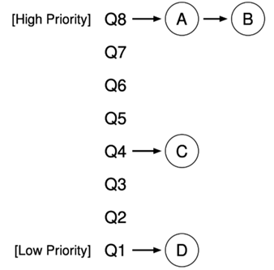

- [处理器调度](#处理器调度)
  - [简化的处理器调度问题](#简化的处理器调度问题)
  - [Round-Robin](#round-robin)
      - [Round-Robin 的问题](#round-robin-的问题)
  - [引入优先级](#引入优先级)
  - [MLFQ](#mlfq)
  - [CFS](#cfs)
      - [CFS 的复杂性](#cfs-的复杂性)
      - [The First Bug on Mars](#the-first-bug-on-mars)

---

# 处理器调度

调度是复杂、有着深远考虑的困难问题

- 下个时间片有 10,000,000 个时钟周期，应该分配给哪个线程？

> 机制 mechanism ：这门课的重点，即 “把一件事做出来”
> 
> 策略 policy ：非常复杂的工程问题，即 “如何做好这件事”

## 简化的处理器调度问题

中断机制

- 处理器以固定的频率被 “中断”
  - Linux Kernel 可以配置：100/250/300/1000Hz
- “中断/系统调用” 返回时可以自由选择 “进程/线程执行”


处理器调度问题的简化假设

- 系统中有一个处理器 (1970s)
- 系统中有多个进程/线程共享 CPU
  - 包括 “系统调用” (进程/线程的一部分代码在 syscall 中执行)
  - 偶尔会 “等待 I/O 返回”，不使用 CPU (通常时间较长)

## Round-Robin

中断之间的线程执行称为 “时间片” (time-slicing)


#### Round-Robin 的问题

系统里有两个进程

- 交互式的 Vim，单线程
- 纯粹计算的 mandelbrot.c, 32 个线程

Vim 处理完输入就又等输入了，主动让出 CPU

而 Mandelbrot 使 Vim 在有输入可以处理的时候被延迟，必须等当前的 Mandelbrot 转完一圈

## 引入优先级

UNIX niceness

- `-20 .. 19` 的整数，越 nice 越让别人得到 CPU
- Linux: nice 相差 10, CPU 资源获得率相差 10 倍
- test
    ```
    taskset -c 0 nice -n 19 yes > /dev/null &
    taskset -c 0 nice -n  9 yes > /dev/null &
    ```

## MLFQ

动态优先级，系统自动设定

- 设置若干个 Round-Robin 队列，每个队列对应一个优先级

- 优先调度高优先级队列
  - 用完时间片的进程
    - Mandelbrot: 优先级变低
  - 让出 CPU I/O 的进程
    - Vim: 优先级变高
- 需要定期把所有人优先级 “拉平”



## CFS

Complete Fair Scheduling

“让系统里的所有进程尽可能公平地共享处理器”

- 为每个进程记录 vruntime (virtual runtime)
- 中断/异常发生后，切换到运行时间最少的进程执行

```c
// vruntime * sched_prio_to_weight[x] == 物理时间

const int sched_prio_to_weight[40] = {
  /* -20 */ 88761, 71755, 56483, 46273, 36291,
  /* -15 */ 29154, 23254, 18705, 14949, 11916,
  /* -10 */  9548,  7620,  6100,  4904,  3906,
  /*  -5 */  3121,  2501,  1991,  1586,  1277,
  /*   0 */  1024,   820,   655,   526,   423,
  /*   5 */   335,   272,   215,   172,   137,
  /*  10 */   110,    87,    70,    56,    45,
  /*  15 */    36,    29,    23,    18,    15,
};
```

#### CFS 的复杂性

1. 子进程继承父进程的 vruntime
2. I/O
3. vruntime (64-bit) 整数溢出

详见 [讲义](https://jyywiki.cn/OS/2022/slides/20.slides.html#/2/5)

#### The First Bug on Mars

详见 [讲义](https://jyywiki.cn/OS/2022/slides/20.slides.html#/3/3)
