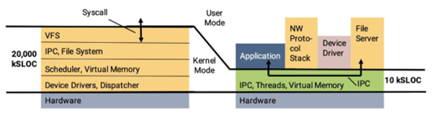

- [操作系统设计](#操作系统设计)
  - [真正的 “操作系统”](#真正的-操作系统)
  - [Microkernel](#microkernel)

---

# 操作系统设计

操作系统设计：一组对象 + 访问对象的 API

本次课回答的问题

- 操作系统应该提供什么 “对象和 API”

## 真正的 “操作系统”

课堂上学到的只是冰山一角

发扬 RTFM & RTFSC

去了解现实生活中真正的操作系统

- [The Open Group Base Specifications Issue 7 (2018 Ed.)](https://pubs.opengroup.org/onlinepubs/9699919799/mindex.html)

- [Windows API Index](https://learn.microsoft.com/en-us/windows/win32/apiindex/windows-api-list)

## Microkernel

> 没有完美的程序员，越小的系统，错误就越少
> 
> 试着用普通进程做更多的事
> 
> - 比如 `execve()` 似乎不必要
> - `mmap()` 似乎绕不开

微内核 (microkernel)

- 只把 “不能放在用户态” 的东西留在内核里
    - 状态机 (拥有寄存器和地址空间的执行流)
    - 状态机之间的协作机制 (进程间通信)
    - 权限管理 (例如设备访问)
- 赋予进程最少的权限，就能降低错误带来的影响

为了安全和正确性

