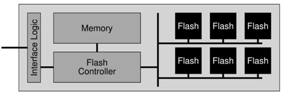

- [存储设备](#存储设备)
  - [持久存储介质](#持久存储介质)
  - [存储介质：磁](#存储介质磁)
  - [存储介质：坑](#存储介质坑)
  - [存储介质：电](#存储介质电)
      - [Flash Memory: 几乎全是优点](#flash-memory-几乎全是优点)
      - [U 盘和 SSD 的区别](#u-盘和-ssd-的区别)
      - [FTL: 性能、可靠性、安全性的难题](#ftl-性能可靠性安全性的难题)

---

> 对 I/O 设备的抽象
> - 物理层：1-bit 的存储

# 存储设备

本次课主要内容

- non-volatile storage

## 持久存储介质

- 逻辑上是一个 bit array
- 根据局部性原理，允许我们按 “大块” 读写
- 评价方法：价格、容量、速度、可靠性

## 存储介质：磁

`磁带 -> 磁鼓 -> 磁盘`

磁盘：计算机系统的主力数据存储

> 现代 HDD 都有很好的 firmware 管理磁盘 I/O 调度，操作系统已经不再试图自作聪明去管理它

## 存储介质：坑

Compact Disk (CD)

在反射平面 (`1`) 上挖上粗糙的坑 (`0`)

## 存储介质：电

上述两类都有一个 fundamental limitation：它们有机械装置，它们的读写头是限制读写速度的最大瓶颈

想要跟上 `SROM/DROM`，就得用 “电”

#### Flash Memory: 几乎全是优点

- 价格：低 (大规模集成电路，便宜)
- 容量：高 (3D 空间里每个 `(x,y,z)` 都是一个 bit)
- 读写速度：高 (直接通过电路读写)
  - 不讲道理的特性：容量越大，速度越快 (电路级并行)
  - 快到淘汰了旧的 SATA 接口标准 (NVMe)
- 可靠性：高 (没有机械部件，随便摔)

==缺点：==

基于它的物理结构，放电 (erase) 做不到 100% 放干净，数千/数万次以后，就好像是 “充电” 状态了，再也不能正确地存储了

==解决：==

每一个 SSD 里都藏了一个完整的计算机系统 (fireware)

里面的 `controller` 会对 `flash` 进行虚拟化，保证每块 `flash` 的剩余寿命都一样，这也是 csapp 中提到的一些算法

#### U 盘和 SSD 的区别

本质上，`U 盘，SD 卡，SSD` 都是 NAND Flash，但它们的 `fireware` 很不相同，决定了它们的性能很不一样

#### FTL: 性能、可靠性、安全性的难题

FTL: Flash Translation Layer

理解了 FTL 之后

- 即便格式化后写入数据 (不写满)，同一个 logic block 被覆盖，physical block 依然存储了数据 (copy-on-write)，这可能就是 “陈冠希” 失败的原因
- 需要文件系统加密
