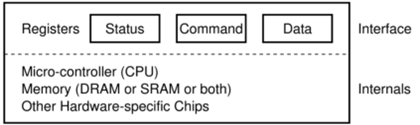
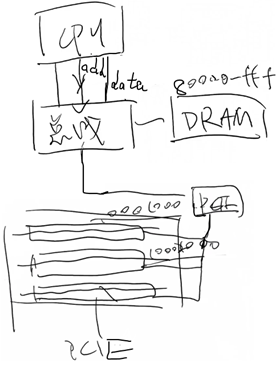
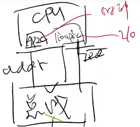
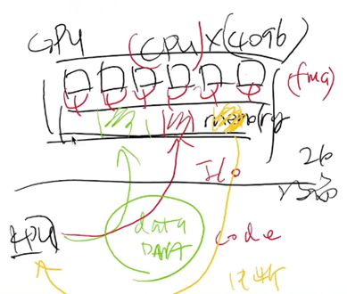

- [输入输出设备](#输入输出设备)
  - [总线](#总线)
  - [中断控制器](#中断控制器)
      - [中断没能解的问题](#中断没能解的问题)
  - [DMA](#dma)
  - [GPU](#gpu)

---

> 对 I/O 设备的抽象
> - 设备层：register + protocol

# 输入输出设备

I/O 设备：一组交换数据的接口和协议



CPU 通过 `interface` 和设备交换数据，CPU 完全不管设备具体是如何实现的

## 总线

总线：一个特殊的 I/O 设备

`lspci -tv` 和 `lsusb -tv` 查看系统中总线上的设备



## 中断控制器



#### 中断没能解的问题

假设程序希望写入 1 GB 的数据到磁盘

- 即便磁盘已经准备好，依然需要非常浪费缓慢的循环
- out 指令写入的是设备缓冲区，需要去总线上绕一圈

```c
for (int i = 0; i < 1 GB / 4; i++) 
{
    outl(PORT, ((u32 *)buf)[i]);
}
```

能否把 CPU 从执行循环中解放出来？

## DMA

Direct Memory Access: 一个专门执行 `memcpy()` 的 CPU

支持的几种 memcpy

- memory → memory
- memory → device (register)
- device (register) → memory

实际实现：直接把 DMA 控制器连接在 “总线” 和 “内存” 上

## GPU

GPU: 一个专门显示图形的 CPU

现代 GPU: 一个通用计算设备

- 一个完整的众核多处理器系统
  - 注重大量并行相似的任务
  - 程序保存在内存 (显存) 中
  - 数据也保存在内存 (显存) 中


