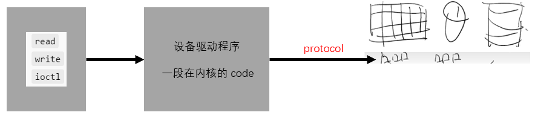

- [设备驱动程序](#设备驱动程序)
  - [抽象](#抽象)
      - [抽象的缺点](#抽象的缺点)
  - [Linux 的设备驱动](#linux-的设备驱动)
      - [例子](#例子)

---

> 对 I/O 设备的抽象
> - 驱动层：可 read/write/ioctl 的对象
> - 块设备层：block read/write

# 设备驱动程序

本次课主要内容

- 什么是设备驱动程序
- Linux 设备抽象

## 抽象

常见的设备都满足这个模型

- byte stream
- byte array

操作系统：设备 = 支持各类操作的对象

- `read()`
- `write()`
- `ioctl()` - 读取/设置设备的状态

例子：`/dev` 中的对象

`/dev/pts/[x]` - pseudo terminal
`/dev/zero`
`/dev/null`
`/dev/random`, `/dev/urandom` - 随机数生成器

#### 抽象的缺点

设备不仅仅是 “数据”，还有 “控制”

“控制” 是占设备最少但最复杂的内容

- 设备的附加功能和配置

这些都全部依赖 `ioctl()`

`man 2 ioctl`: Arguments, returns, and semantics of ioctl() vary according to the device driver in question

## Linux 的设备驱动

本质上就是实现 `struct file_operations` 里的函数

课上我们用 [Kernel module](https://wiki.archlinux.org/title/Kernel_module) 来动态加载一个虚拟设备 `launcher.c` 到 kernel

#### 例子

在 linux-minimal 上模拟核弹发射装置

`launcher.c` -> `launcher.ko` -> `insmod nuke/launcher.ko` -> `mknod /dev/nuke0 c 237 0` -> `cat hello > /dev/nuke0`

- `lsmod` 可查看 launcher 是否载入成功

Makefile 中 `KDIR := $(realpath ../../linux-source-5.4.0)`: No such file

核心代码在 [launcher](./code/launcher/)