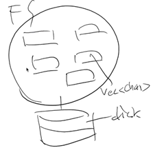
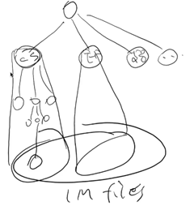
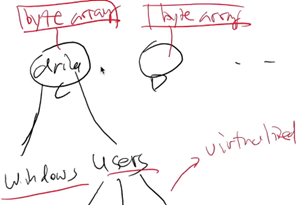
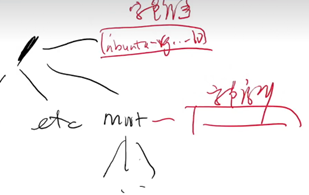

- [文件系统](#文件系统)
  - [为什么需要文件系统](#为什么需要文件系统)
  - [树的构建](#树的构建)
      - [Windows](#windows)
      - [Linux](#linux)
  - [文件系统 API](#文件系统-api)
      - [硬 (hard) 链接](#硬-hard-链接)
      - [软 (symbolic) 链接](#软-symbolic-链接)
      - [文件描述符](#文件描述符)

---

# 文件系统

本次课内容

- 应用程序共享==存储设备==

## 为什么需要文件系统

尽管 OS 提供了访问 “存储设备” 的 API 如 `write()`，提供了相应的设备驱动程序

- `write()` 能保证原子性，能正确处理并发的请求

但是还不够，比如：

一个程序想要保存一段 text 到磁盘，它应该保存到哪里呢，它是否会覆盖已有的数据呢

所以光是应用程序能正确访问 “存储设备” 是不够的，我们还需要一个 FS 来进行再一层的抽象，利用 “虚拟磁盘” 的思想，使得

- 应用程序能共享数据
- 提供一定的隔离



## 树的构建

利用信息的局部性组织虚拟磁盘

虚拟模型：建立起下图中的这样一棵树



#### Windows

每个设备是一棵树

- 优盘分配给新的盘符



#### Linux

允许任意目录 “挂载 (mount)” 一个设备代表的目录树

- 对虚拟设备的 “挂载” 还额外引入了 “loopback 设备”



==mount 系统调用==

```c
int mount(const char *source, const char *target,
          const char *filesystemtype, unsigned long mountflags,
          const void *data);
```

> Linux 的 mount 命令行工具就是对 syscall(mount) 的封装

==“真正” Linux 的启动流程==

```bash
export PATH=/bin
busybox mknod /dev/sda b 8 0
busybox mkdir -p /newroot
busybox mount -t ext2 /dev/sda /newroot
exec busybox switch_root /newroot/ /etc/init
```

通过 `pivot_root` 实现根文件系统的切换

## 文件系统 API

- mkdir
- rmdir
- getdents
  - 遍历
- chdir 
  - change working directory
  - 内部命令，只有系统调用才能修改

#### 硬 (hard) 链接

硬链接：仅存储指向文件数据的指针

- 创建：`ln`，用系统调用 `link` 实现 
- 删除：`unlink`（ 系统调用 ）

大部分 UNIX 文件系统所有文件都是硬连接 (`ls -i` 查看)

#### 软 (symbolic) 链接

软链接：存储一个 “跳转提示”

链接指向的位置当前不存在也没关系

引入软链接，目录树不再是 “树”，而变成了一个 “图”

- `ln -s` 创建软链接

#### 文件描述符

文件描述符：指向一个虚拟磁盘的 “指针”

- 通过 `open/pipe` 获得
- 通过 `close` 释放
- 通过 `dup/dup2` 复制
- `lseek` 管理文件访问的游标
- `ftruncate` 截取
- `fork` 时继承