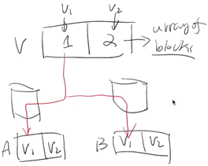
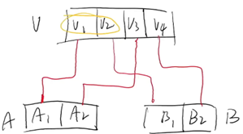
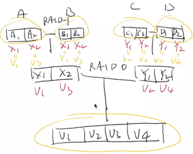
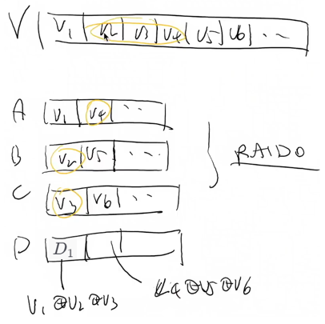
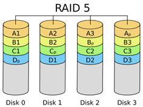
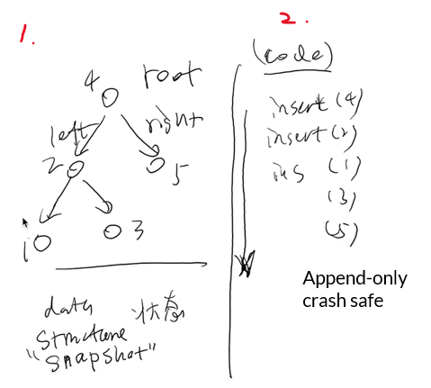
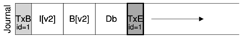

- [持久数据的可靠性](#持久数据的可靠性)
  - [RAID](#raid)
      - [RAID-1](#raid-1)
      - [RAID-0](#raid-0)
      - [RAID-10](#raid-10)
      - [RAID-4: Parity Disk](#raid-4-parity-disk)
      - [RAID-5: Rotating Parity](#raid-5-rotating-parity)
  - [Crash Consistency](#crash-consistency)
      - [Journaling](#journaling)
      - [File System Checking (FSCK)](#file-system-checking-fsck)

---

# 持久数据的可靠性

本次课回答的问题

- 持久数据是不能接受丢失的，如何保证持久数据的可靠性？

## RAID

Redundant Array of Inexpensive Disks

把多个 (不可靠的) 磁盘虚拟成一块非常可靠且性能极高的虚拟磁盘

假设

- 磁盘可能在某个时刻忽然彻底无法访问 (数据完全丢失)
- 磁盘能报告这个问题

#### RAID-1

- A B 是镜像的关系
- 容错，且 read 速度翻倍 (假设内存远快于磁盘)(道理同下)

#### RAID-0

- 虽然不能容错，但可以利用好磁盘的带宽
  - 虚拟磁盘上的连续 read/write 可以转化为多个物理磁盘上并行的连续 read/write 

#### RAID-10

RAID-0 over RAID-1

有时能容忍两块盘坏，有时候却不能（承接 RAID-1 的特性）

#### RAID-4: Parity Disk

留一块磁盘 `D` 作为校验盘来备份 RAID-0，达到类似 RAID-10 的效果

其中 $D_1=V_1 \bigoplus V_2 \bigoplus V_3$

举例：

- 当 A 盘损坏，恢复 A 盘数据的公式如下
  - $V_1=D_1 \bigoplus V_2 \bigoplus V_3$（ 异或相关的运算公式导出的结果 ）

至此，只用额外一块的磁盘就能得到容错

但引入了一个新麻烦

- 低性能的随机写
  - 比如修改 $V_1$，那么必需的修改 $D_1$
    - $\qquad D_1^{'}=V_1^{'} \bigoplus V_2 \bigoplus V_3$
    - $\Longrightarrow D_1^{'}=V_1^{'} \bigoplus D_1 \bigoplus V_1$
  - 所以随机写要修改至少两个盘 `A` `D`，性能减少

#### RAID-5: Rotating Parity

优化了 RAID-4 的缺点

让每一块盘都有均等的机会存储 parity

(老师没详细解释，我也没想明白到底优化了什么)

## Crash Consistency

> Crash Consistency: Move the file system from one consistent state to another atomically 

==问题==

比如在文件系统 FAT 上 append 一个字节，也涉及 n 处磁盘的修改

- 这 n 处磁盘的 `bwrite()` 顺序该是什么？
  - 磁盘不提供多块读写的 “all or nothing”（原子性）
  - 为了性能，OS 提交的这 n 处顺序甚至会被固件打乱（顺序性）
- 修改了 i ( < n ) 处磁盘后，操作系统内核可能 crash，系统可能断电

文件系统被错误中断会进入了 “不一致” 的状态

==解决方案==

1. Journaling
2. FSCK

#### Journaling

我们的 “文件系统” 本质上是维护了一个数据结构，它的两个视角如下

数据结构操作发生时（即磁盘收到了写请求）

1. 记录 journal
   - 定位到 journal 的末尾 ( `bread()` )
   - `bwrite(TXBegin)` 和 `bwrite(ops)`
   - `bflush()` 等待数据落盘
   - `bwrite(TXEnd)`
   - `bflush()` 等待数据落盘

2. 真正地改写磁盘
   - 上一步确定完成后，再将 “实际数据结构操作” 写入磁盘
   - 等待数据落盘后，删除 (标记) 日志

在 `1.` 结束之前 crash，丢掉 `1.` 所进行的所有工作

在 `2.` 结束之前 crash，重放日志

( 假设 journal 是一个无限长的 byte array )

#### File System Checking (FSCK)

一种恢复到 “一致性” 的研究