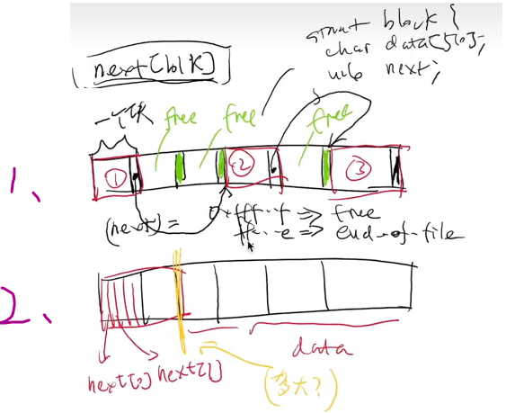
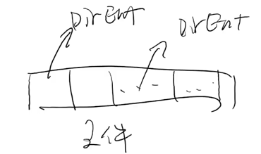

- [FAT](#fat)
  - [文件](#文件)
  - [目录](#目录)
  - [实操](#实操)

---

参考

- [jyy 视频：2020, 27](https://www.bilibili.com/video/BV1oZ4y1t7ce/?spm_id_from=333.788&vd_source=454e9c56dd1d2d25131e921b939a8d39)
- [Microsoft FAT Specification ](https://jyywiki.cn/pages/OS/manuals/MSFAT-spec.pdf)

# FAT

File Allocation Table

```c
int balloc(); // 返回一个空闲可用的数据块
void bfree(int id); // 释放一个数据块
vector<struct block *> file; // 文件
// 文件的名称、大小等保存在目录中
```

[RTFM: Microsoft FAT Specification ](https://jyywiki.cn/pages/OS/manuals/MSFAT-spec.pdf)

一切细节都在手册

## 文件

用链表实现 `vector<struct block *> file` 的两种方式



权衡后用 `2、` ，解决缺陷的方式是对 `FAT` 进行备份

> `FAT` 指的是存储 next[] 的区域

## 目录

A directory ia a file struct too, is a array of 32 byte `directory entries`

Each `directory entry` represents a contained file or sub-directory directory



## 实操

Linux 命令 `mkfs.fat` 把一个普通文件变成 fat 镜像

- strace：`write` 调用把文件的头部分内容进行初始化（见手册）

对照手册，写出一个遍历 FAT 文件系统的脚本：[fatfree.c](https://jyywiki.cn/pages/OS/2022/demos/fatree.c)