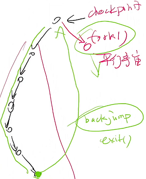

- [FORK](#fork)
  - [fork() 的行为](#fork-的行为)
      - [文件描述符](#文件描述符)
      - [地址空间](#地址空间)
  - [其他应用](#其他应用)
  - [A fork() in the Road](#a-fork-in-the-road)
  - [POSIX Spawn](#posix-spawn)


# FORK

## fork() 的行为

#### 文件描述符

```c
// 文件又被写入 Hello 又被写入 World

int fd = open("a.txt", O_WRONLY | O_CREAT);
pid_t pid = fork();

if (pid == 0)
{
    write(fd, "Hello");
}
else
{
    write(fd, "World");
}
```

`fork` 后，父子进程共享 `fd` 的文件偏移量 `offset`

让程序行为符合人的认知

> 那 `dup()` 得到的两个文件描述符是共享 `offset` 吗 ？


#### 地址空间

概念上状态机被复制，但实际上内存并没有即刻被申请，而是一份原内存被父子进程共享

- “Copy-on-write” 即只有被改变的页面才会真正被申请
    - `fork()` 后，整个地址空间被父子进程共享，都被标记为 “只读”
    - 操作系统捕获 Page Fault 后酌情申请页面
    - fork-execve 效率得到提升
- 操作系统会维护每个页面的引用计数

代码 [cow-test](./code/cow-test.c) 证明上述事实

- 父进程申请了 128 MB 的内存
- `fork()` 1000 次后依然没有内存不够

## 其他应用

`dfs-fork.c` : 连回溯都可以不要了



## A fork() in the Road

在操作系统的演化过程中，进程增加了更多的东西

- 信号
- 线程
- 进程间通信对象
- ptrace (追踪/调试)

这使得 `fork()` 有如下缺陷

- Fork is no longer simple
- Fork doesn’t compose - [fork-printf.c]()
- Fork isn’t thread-safe
- Fork is insecure - 打破了 Address Space Layout Randomization
- Fork is slow
- Fork doesn’t scale
- Fork encourages memory overcommit

## POSIX Spawn

```c
int posix_spawn(
    pid_t *pid, char *path,
    posix_spawn_file_actions_t *file_actions,
    posix_spawnattr_t *attrp,
    char * argv[], char * envp[]);
```

参数

- `pid`: 返回的进程号
- `path`: 程序 (重置的状态机)
- `file_actions`: open, close, dup
- `attrp`: 信号、进程组等信息
- `argv, envp`: 同 execve

很明显：这是一个 “后设计” 的 API