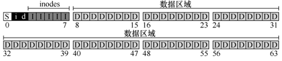
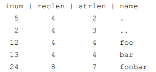

- [文件系统实现](#文件系统实现)
  - [整体组织](#整体组织)
  - [inode](#inode)
  - [目录](#目录)
  - [访问路径](#访问路径)
  - [FFS](#ffs)
      - [策略：如何分配文件和目录](#策略如何分配文件和目录)

参考

- [OSTEP: File System Implementation](https://pages.cs.wisc.edu/~remzi/OSTEP/Chinese/40.pdf)

# 文件系统实现

第一个方面是文件系统的数据结构 data structure，文件系统在磁盘上使用哪
些类型的结构来组织其数据和元数据

文件系统的第二个方面是访问方法 access method

## 整体组织

是将磁盘分成块 block

以块为单位将磁盘依次分成下面 5 个区域

- superblock: 包含关于该特定文件系统的信息
- inode bitmap： 记录 `inode` 是空闲还是已分配
- data bitmap： 记录 `data` 是空闲还是已分配 
- inode table
- data region

## inode

index node

在每个 inode 中，实际上是所有关于该文件的信息 metadata

- 比如文件 `a.txt` 的 `inumber` 为 `n`，那么 `inode[n]` 中存的就是它的信息

inode 本质上是一个数据结构，里面包含

- mode
- size
- block  一组磁盘指针（共 15 个）
  - 直接
  - 间接
  - 多级索引指向该文件的 “用户数据” 所在磁盘位置

## 目录

一个目录的信息也存在一个 inode 中，inode 指向的 “用户数据块” 的解读如下

## 访问路径

- 从磁盘读取文件
- 创建新文件

这些操作其实会导致多个 `I/O` 的，访问多个 inode，访问 “用户数据块”，甚至访问 bitmap

## FFS

Fast File System

基于磁盘的物理结构，确保先后访问两个文件不会导致穿越磁盘的长时间寻道

FFS 将磁盘划分成一些 “柱面组” cylinder group

每个组的样子如下

- 每个组中都有 super block 的一个副本
- ib, db 记录该组的 inode 和数据块是否已分配

#### 策略：如何分配文件和目录

FFS 必须决定什么是 “相关的”，并将它们置于同一个组内