- [虚拟内存](#虚拟内存)
  - [虚拟寻址 virtual addressing](#虚拟寻址-virtual-addressing)
  - [DRAM 是 “磁盘” 的 cache](#dram-是-磁盘-的-cache)
      - [缓存的结构组织](#缓存的结构组织)
      - [页表 page table](#页表-page-table)
      - [缺页](#缺页)
      - [局部性救了我们](#局部性救了我们)
      - [保护内存](#保护内存)
  - [地址翻译](#地址翻译)
      - [硬件执行步骤](#硬件执行步骤)
      - [TLB](#tlb)
      - [多级页表](#多级页表)
      - [例子](#例子)

---

# 虚拟内存

VM 对内存的使用和管理造成了深远的影响

- 简化 link
- 简化 load
- 简化 share
- 简化 malloc

## 虚拟寻址 virtual addressing

地址翻译需要 CPU 硬件和操作系统之间的紧密合作

“MMU” 利用存放在 “主存” 中的 “page table” 来动态翻译虚拟地址，“page table” 的内容由 OS 来管理

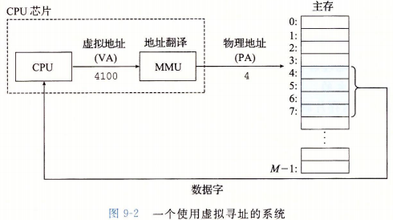

## DRAM 是 “磁盘” 的 cache

cache “块” 被称为 “页”，假设 “页大小” 为 $P=2^p$

假设虚拟地址空间大小为 $N=2^n$，$num\_of\_ VPs = \displaystyle\frac{2^n}{2^p}$ 

假设物理地址空间大小为 $M=2^m$

一个 “虚拟页面” 有三个状态

- 未分配：没有任何数据和该页关联，例如可能是为了进程之后 `malloc()` 调用预留的空间
- 缓存的：该页已经缓存在 DRAM 中
- 未缓存的

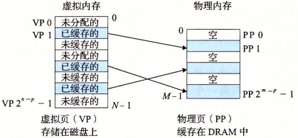

> 在这里 DRAM 就是上文的 “主存”，也或者叫 “物理内存”

#### 缓存的结构组织

磁盘访问开销太大，所以 DRAM 缓存的结构组织都是为了避免访问磁盘

- 虚拟页很大
- 全相联
- 复杂精密的替换算法
- 写回

#### 页表 page table

OS 为每个进程提供了一个独立的 page table

page table 将 VP 映射到 PP

- page table is an anrray of PTEs
- (page table).size = $\displaystyle\frac{2^n}{2^p}$
- 一个 PTE 反映一个 VP 的映射

我们假设每个 PTE 由一个 “有效位” 和一个 “n 位地址字段” 组成

1. “有效位” 表明该虚拟页是否缓存在 DRAM
2. “地址字段”
   - `“有效位” == true`，“地址字段” 指向主存的位置
   - `“有效位” == false`，“地址字段” 指向磁盘的位置
   - `“有效位” == false`，“地址字段” 指向 `null` 表示 “未分配”

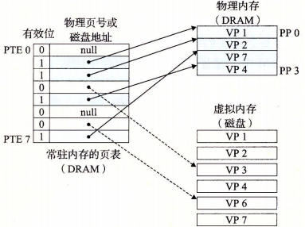

#### 缺页

“缺页” 的缓存视角就是 “不命中” （page fault）

举例， VP3 缺页，替换 VP4

1. 触发一个缺页异常
2. 调用内核中的缺页异常处理程序，选择一个 “牺牲页”（存放在 PP3 的 VP4）
3. “写回” VP4 到磁盘，内核修改对应的 PTE4
4. 内核再从磁盘复制 VP3 到 PP3，更新 PTE3
5. 重新启动导致缺页的指令

有些书上把这叫做 “页面调度”

#### 局部性救了我们

表面上多引入 “虚拟内存” 会额外降低效率

但只要我们程序有良好的时间局部性，即是缺页越少，“虚拟内存” 就会工作得很好

> Linux 用 `getrusage` 函数检测缺页情况

#### 保护内存

在 PTE 上添加一些额外的 “许可位”，来控制访问权限

如果一条指令违反了这些 “许可条件”，触发 segmentation fault

如下图：`SUP READ WRITE`

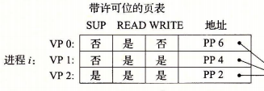

## 地址翻译

本节目标：了解 MMU 在虚拟内存中担任的角色

页表实现映射：

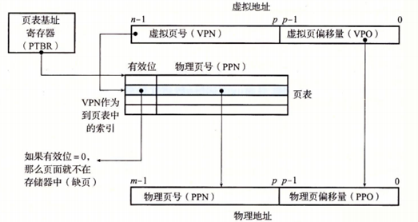

- MMU 得到一个虚拟地址
- 利用 VPN 来选择适当的 PTE
- 将对应 PTE 中的地址 PPN 和 VPO 串联起来得到物理地址

（因为物理地址和虚拟地址的页大小一样，所以 PPO == VPO）

#### 硬件执行步骤

==命中==

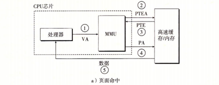

1. CPU 把 VA 传给 MMU
2. MMU 得到 PTE 的地址（`PTBR + VPN`），传给内存
3. 内存返回 MMU 对应 PTE 内容
4. MMU 构造 PA，传给内存
5. 返回 data 到处理器

==不命中==

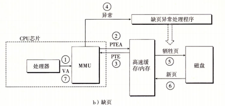

1. CPU 把 VA 传给 MMU
2. MMU 得到 PTE 的地址（`PTBR + VPN`），传给内存
3. 内存返回 MMU 对应 PTE 内容
4. PTE 中有效位是 `0`，触发异常，启动缺页异常处理程序
5. 确定出牺牲页，换到磁盘
6. 调入新页面，跟新 PTE
7. 程序返回，再次执行导致缺页的指令（步骤 1：CPU 将 VA 重新发给 MMU）

==MMU 和内存之间通常还有高速 cache==

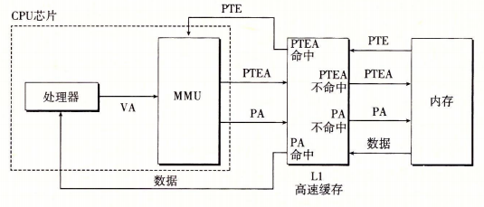

#### TLB

TLB 本质上是存放 PTE 的 cache （ translation lookaside buffer ）

- TLB 的每一行都保存一个 PTE
- 组相联，相联度高

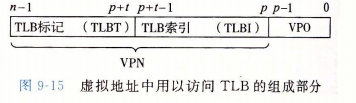

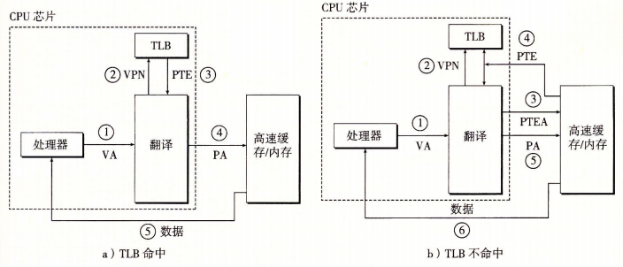

#### 多级页表

减少内存压力：用内存来维护一个 page table，耗费空间太多

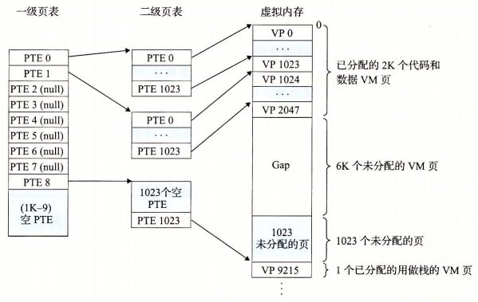

`1` 个一级 PTE 映射 `1024` 个二级 PTE

`1` 个二级 PTE 映射 `1` 个 VP

注意：假设一个 PTE 大小 4B，一个一级 PT 或者一片二级 PTE 刚好又是一个页面大小

==多级页表的索引方式==

见原书 P579 ：core i7 的地址翻译

==优点==

1. 如果一级 PT 中一个 PTE 是 null，它对应的二级 PT 根本不存在
   - 这是一种巨大的潜在节约，因为一个大程序，很多地址空间都未分配
2. 只有一级 PT 才总是在内存中，在需要时创建、调入、调出二级 PT，只有经常使用的二级才在内存

> 引入多级页表，虚拟地址的结构不受影响，简单的数学证明

#### 例子

见 P573，`9.6.4`

手工模拟 “地址翻译” 的例题