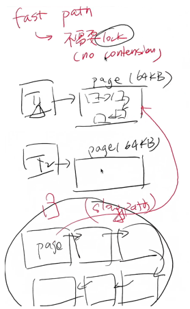

- [L1](#l1)
  - [实验描述](#实验描述)
  - [性能考量](#性能考量)
  - [实现](#实现)
  - [后记](#后记)
      - [速通版的代码尝试](#速通版的代码尝试)
      - [csapp 版本](#csapp-版本)


---

# L1

## 实验描述

在 AbstractMachine 启动后，`[heap.start, heap.end)` 会给出一段可用的物理内存

目的：你需要在此基础上实现允许==多个处理器==并发地申请或释放内存的分配器

- `void *kalloc(size_t size);`  // 内存分配

- `void kfree(void *ptr);` // 内存释放

- `void pmm_init()` 
  - 在多处理器启动前调用 ( 即 `os->init()` 中)  
  - 在这里完成 “数据结构、锁” 的初始化等

它的数学模型见 [讲义：2. 实验描述](https://jyywiki.cn/OS/2022/labs/L1.html)

一些作为计算机系统软件基础设施的要求

- 对于大小为 s 的内存分配请求，返回的内存地址必须对齐到 $2^i$
  - 分配 17 字节内存返回的地址必须是 32 的整数倍
- 允许多处理器并行地调用 kalloc/kfree

## 性能考量

我们考虑的实际的 workload

- 高频率的小对象创建
- 低频率的大对象创建

因此考虑 fastpath 和 slowpath，实现两套系统

- 每个 thread 分配 `thread-local allocation buffer`，小内存分配时不会发生竞争和拥堵

- 当内部内存不够或者分配大内存这样时，走 slowpath ：获得大锁去全局池拿取内存



思路见 [视频: part(malloc&free)](https://www.bilibili.com/video/BV17F411s7e9/?spm_id_from=333.788&vd_source=454e9c56dd1d2d25131e921b939a8d39)

## 实现

一个速通的实现见[视频: part(L1)](https://www.bilibili.com/video/BV1iY411A7w1/?spm_id_from=333.788&vd_source=454e9c56dd1d2d25131e921b939a8d39)

abstarct-machine 提供的 api

```c
int cpu_current(); // 返回当前执行流的 CPU 编号
int cpu_count();   // 返回系统中处理器的个数，在整个 AbstractMachine 执行期间数值不会变化

// 如果要启动多个处理器，可以为 make run 传递 smp 环境变量，例如 smp=2
```

```c
int atomic_xchg(int *addr, int newval); // 原子交换
```

```c
assert();
panic_on();
```

## 后记

#### 速通版的代码尝试

代码见 [pmm.c](./L1code/pmm_se.c)

bugs
1. test 中有时候会在 heap full 之前就突然结束，没有任何报错，不知道原因？
2. line 45 when case: 'heap full' happen
   - `halt() panic_on() assert()` 会导致一些 ERROR，不知道为什么？

#### csapp 版本

待看

参考

- [CSAPP 实验 Malloc Lab](https://zhuanlan.zhihu.com/p/490514848)