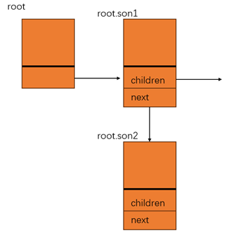

- [M1](#m1)
  - [tree](#tree)
  - [缺陷列表](#缺陷列表)
      - [1](#1)

---

[NJUOSLAB M1: 打印进程树 (pstree)](https://github.com/SiyuanYue/NJUOSLab-M1-pstree)


# M1

这是南京大学JYY讲授的的操作系统课的实验M1的实现

实验要求与手册请看：https://jyywiki.cn/OS/2022/labs/M1.html

实现一个三种选项（ `-V -n -p` ）和默认的 pstree 命令，通过读取 Linux 中 /proc 下的内容打印出进程树

- /proc/pid/stat 文件中有 name 和 ppid

  - 阅读 man 5 proc 等参考资料，反正我没读

核心代码在 [pstree.c](./pstree.c)

## tree

`node x` 的儿子是个单链表，由 `children` 找到

`node x` 的多个儿子间用 `next` 连接



## 缺陷列表

#### 1

当进程名称出现空格 ` ` 时，如：（ `tmux：sever` ）

```c
fscanf(fp, "%d (%s %c %d", &_pid, pname, &i, &ppid); 
```

我的 `fscanf` 不能正确解读这个情况

- `panme` 被赋值为 tmux
- `i` 被赋值为 s
- `ppid` 失败

但是在我的 linux 中输出结果为

- 没有打印出 `tmux: server`，即 pid 为 194857 的进程
- 但是打印出了 `tmux: client` 的一部分 `tmux`，即 pid 为 196377 的进程

我擦，这个 bug 产生原因终于被我找到，原因在于 `scanf` 失败后，临时变量 ppid 的随机值依然会赋值给 `pidinfos[]`，非常巧的事情是，赋给 `tmux: client` 的随机值恰好又他妈是一个有效进程号，所以它的名字会被 print 在控制台( pstree.c line:62)

然而 `tmux: server` 的运气没有那么好，随机值是无效进程号，找不到它的父进程，不会被 print

离开 VScode，我的 edit 和 debug 效率真是低得另人发指 ！！！ 