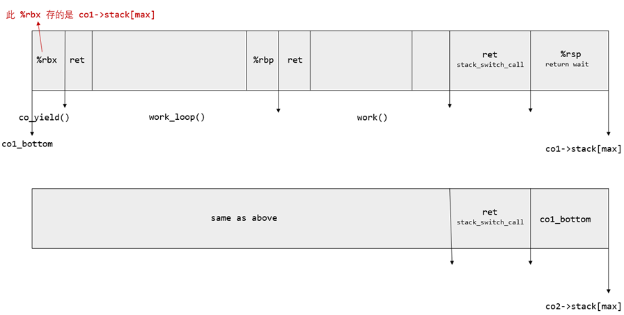

- [M2](#m2)
  - [struct co](#struct-co)
  - [co\_yield](#co_yield)
  - [协程切换](#协程切换)
  - [缺陷列表](#缺陷列表)
      - [栈示意图](#栈示意图)
      - [测试分析](#测试分析)
      - [其他想法](#其他想法)


---

参考

- [src: libco](https://github.com/SiyuanYue/NJUOSLab-M2-libco)
- [知乎的一篇文章: 协程库](https://zhuanlan.zhihu.com/p/490475991)
  - 更加漂亮的源代码
  - stack_switch_call 的描述

# M2

coroutine 协程，也称为 user-level threads ( 不借助操作系统 API )

线程可以看成是每一条语句后都 “插入” 了 `co_yield()` 的协程

每个协程需要拥有独立的 “堆栈" 和 "寄存器”，和 "共享的内存"

实验的要求见[讲义](https://jyywiki.cn/OS/2022/labs/M2.html) 

- 2.1. 实验要求
- 4.3. 实现协程：分析

核心代码 [co.h](co.h) [co.c](co.h)

## struct co

```c
enum co_status {
  CO_NEW = 1, // 新创建，还未执行过
  CO_RUNNING, // 已经执行过
  CO_WAITING, // 在 co_wait 上等待
  CO_DEAD,    // 已经结束，但还未释放资源
};

struct co {
  char *name;
  void (*func)(void *); // co_start 指定的入口地址
  void *arg; //和参数

  enum co_status status;  // 协程的状态
  struct co *    waiter;  // 是否有其他协程在等待当前协程
  jmp_buf        context; // 寄存器现场 (setjmp.h)
  uint8_t        stack[STACK_SIZE]; // 协程的堆栈
};
```

## co_yield

==`co_yield()` 的行为==


把 yield 瞬间的 call preserved registers “封存” 下来，然后执行堆栈 (rsp) 和执行流 (rip) 的切换：

```c
mov (next_rsp), $rsp
jmp *(next_rip)
```

返回时，必须保证 `rsp,` `rbx, rbp, r12, r13, r14, r15` 的值和调用时保持一致

推荐使用 C 语言标准库中的 [setjmp/longjmp](https://www.cnblogs.com/hazir/p/c_setjmp_longjmp.html) 函数来实现寄存器现场的保存和恢复

==`co_yield()` 的原型==

```c
// 实现协程的切换

void co_yield() {
  int val = setjmp(current->context);
  if (val == 0) {
    // 协程切换
  } else {
    // ?
  }
}
```

> CFLAGS += -U_FORTIFY_SOURCE，用来防止 __longjmp_chk 代码检查到堆栈切换以后报错 (当成是 stack smashing)

## 协程切换

假设算法得出下一个执行的协程为 `co_next`

1. `co_next.status == CO_NEW`，首先执行 `stack_switch_call()` 切换堆栈，然后开始执行协程的代码；
2. `co_next.status == CO_RUNNING`，此时该协程已经调用过 `setjmp()` 保存寄存器现场，我们直接 `longjmp()` 恢复寄存器现场即可

> 至于得出 co_next 算法是如何，不是本次重点，并没有仔细讨论
> 
> 暂时用的循环链表，遍历得到下一个符合条件的协程

## 缺陷列表

测试案例，`//` 为案例不同的地方


1. 结果符合预期
    ```c
    static void work_loop(void *arg) {
        const char *s = (const char*)arg;
        for (int i = 0; i < 1; ++i) {
            printf("%s%d  ", s, get_count());
            add_count();
            co_yield();//
        }
    }
    ```

2. Segmentation faultnt
    ```c
    static void work_loop(void *arg) {
        const char *s = (const char*)arg;
        for (int i = 0; i < 1; ++i) {
    /* 1. */ co_yield();//
    /* 2. */ printf("%s%d  ", s, get_count());
    /* 3. */ add_count();
        }
    }
    ```

3. 结果符合预期
    ```c
    static void work_loop(void *arg) {
        const char *s = (const char*)arg;
        for (int i = 0; i < 1; ++i) {
            co_yield();
            printf("%s%d  ", s, g_count);//
            g_count++;//
        }
    }
    ```

#### 栈示意图



#### 测试分析

我们预期 `co2` 返回 `co_wait()` 的流程如下：( 此时我们在 `co2` 栈中 )

1. `work()` 及它之前的函数正常返回，然后正常 `ret stack_switch_call`
2. `movq -0x10(%0) ,%%rsp;` 把 `%rsp` 赋值为 `co1_bottom`
3. 得到 `co1` 栈中 `$rbx`，然后经过 3 个 ret 得到 `%rsp return co_wait`

==测试 2 中==

- `co1` 最后一次执行 `/* 2. */` 前，弹出了正确的 `%rbx` 并从 `/* 1. */` 返回
  - 此时 `%rsp` 为 `co1_bottom + 0x10`
- 它调用 `/* 2. */` 时，`get_count()` 的栈会覆盖 `[co1_bottom, co1_bottom + 0x10]` 的内容
- 等到 `co2` 进行到流程 `3.` 时，就再也得不到正确的 `$rbx` 了

==测试 1 中==

1. `co_yield()` 在 `get_count() add_count()` 之后
2. 我们的 `co_next` 算法

两个性质共同保证了 `co2` 返回 `co_wait()` 前 `[co1_bottom, co1_bottom + 0x10]` 不会被覆盖

结果符合预期

==测试 3 中==

`get_count() add_count()` 的调用改为普通语句，不会增长栈

结果符合预期

#### 其他想法

`[co1->stack[max-16], co1->stack[max-8]]` 保存了 `%rsp return co_wait` 

- `co1` 得以正确返回

`[co2->stack[max-16], co2->stack[max-8]]` 保存了 `co1_bottom`

- 通过走 `co1` 的一系列 `ret` 也能正确返回

如果 `[co2->stack[max-16], co2->stack[max-8]]` 直接保存 `%rsp return co_wait` 来正确返回 `co_wait()` 是否行得通呢？

每个 `co` 为了返回 `co_wait()` 都需要最终得到一样的 `%rsp`

能不能直接把这个 `%rsp` 保存为全局变量让所有 `co` 共享呢？
