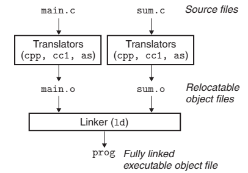

- [目标文件](#目标文件)
  - [可重定位目标文件](#可重定位目标文件)
      - [section `.symtab`](#section-symtab)
- [静态链接](#静态链接)
  - [符号解析](#符号解析)
      - [解析多重定义的全局符号](#解析多重定义的全局符号)
      - [静态库](#静态库)
      - [解析流程](#解析流程)
  - [重定位](#重定位)
      - [Relocation Entries](#relocation-entries)
      - [重定位算法](#重定位算法)
- [加载](#加载)

---

参考

- [csapp version_3 chinese]()

介绍链接

# 目标文件

- 可重定位目标文件
- 可执行目标文件
- 共享目标文件

## 可重定位目标文件


每个 section 的描述见 csapp p467

#### section `.symtab`

模块 m 的 section `.symtab` 记录一张符号表包括 

- m 引用的外部 funcName/globalVarName
- m 定义的 (static) funcName/globalVarName
- m 定义的 static localVarName

注意：不包括 `{int a;}` 这种语句定义出来的 `a`

> 模块可以理解为一个 `.o` 文件

这张符号表本质上是一个 `Elf64_Symbol` 结构体数组


用 `readelf -s` 得到类似如下的结果


其中 `type` 要么是 `OBJECT` ( 数据 ) 要么是 `FUNC` ( 函数 )，但有三个特殊情况

- `ABS`
- `UNDEF`
- `COMMON` 用来表示未初始化的 global var

概念上 `COMMON` 应该是属于 `.bss` 的 `OBJECT`，但额外有这个区分是为了让 linker 能够解析 [多重定义的全局符号](#解析多重定义的全局符号)

也就是说，当源文件中有 “多重定义的全局变量” 时，未初始化的 global var 在 link 阶段完成之前，并不能确定是哪个模块的，所以并不能把它的 `type` 设置为 `OBJECT`

其它对 `Elf64_Symbol` 结构体的解读见 csapp p469


# 静态链接



> $main.c\xrightarrow[]{cpp}main.i\xrightarrow[]{cc1}main.s\xrightarrow[]{as}main.o$
>
> 这一系列流程所需的工具集叫做 compiler driver，如 GNU 就提供了这些工具集

为构造 Fully linked executable object file，linker 需要完成的任务

- 符号解析 symbol resolution
  - 将每一个符号 “引用” 和它的 “定义” 关联起来（ “定义” 是唯一的 ）
- 重定位 relocation
  - 确定运行时地址

## 符号解析

将 “引用” 与唯一的 “定义” 关联起来

#### 解析多重定义的全局符号

在全局符号中

- 函数和有初始化的全局变量是 ‘强’
- 未初始化的全局变量是 ‘弱’

Linux linker 使用下面规则来处理多重定义的符号


1. 不允许有多个同名的强
2. 如果有一个强，多个弱，那么选择强
3. 如果有多个弱，随便选一个

示例代码见 csapp p472

#### 静态库

"静态库" 以一种称为 archive 的特殊文件格式存在于磁盘，本质上是一组 “可重定位目标文件” 的集合

`.a` 后缀标识

创建静态库，我们使用 AR 工具，如下

```bash
gcc -c a.c b.c
ar rcs libXKY.a a.o b.o
```

为了使用这个库

```bash
gcc -c main.c
gcc -static main.o ./libXKY.a
# 或者
gcc -static main.o -L. -lXKY

# -lXKY 是 libXKY.a 的缩写，-L. 参数是表在当前目录下找 libXKY.a
```

#### 解析流程

linker 从输入从左到右扫描 “可重定位目标文件” 和 “archive”

在这次扫描中，linker 维护

1. 一个可重定位目标文件集合 E
2. 一个引用但未定义的符号集合 U
3. 一个已经定义的符号集合 D

初始时，三个集合都为空

1. 对于每一个输入文件 f，如果是目标文件，f 添加到 E，修改 U 和 D 来反映 f 中的符号定义和引用，并继续判断下一个输入文件
2. 如果 f 是 “archive”，那么 linker 会尝试匹配 U 中的符号和 “archive” 成员定义的符号。如果某个 “archive” 成员 m，定义了 U 中的引用，那么将 m 添加到 E，并且对应修改 U 和 D。对 “archive” 中的所有成员进行如上步骤，直到 U 和 D 不再改变，再继续判断下一个输入文件
3. 如果扫描完所有输入文件后，U 是非空，报错

关于库的一般准则是讲它们放在命令行的结尾

- 从上段算法可知，如果 “archive” 在 “可重定位目标文件” 的前面，那么 “archive” 的任何一个成员都不可能加入到 E 中，因为对 “archive” 来说，U 永远是空的

如果 “archive1” 和 “archive2” 不是相互独立的，在命令行中至少有一个 s 的定义是在对 s 的引用之后

- 假设 foo.c 调用 libx.a liby.a，而 liby.a 引用了 libx.a 中的符号
- `gcc foo.c liby.a libx.a` 才不会报错

## 重定位

两步

1. linker 将所有同类型的 section 合并，将运行时内存地址赋给新的聚合 section，这一步骤之后，程序的每一条指令和全局变量都有唯一的运行时内存地址了
   - 集合 E 中的 section `.data` 合并成一个 section，成为可执行目标文件的 section `.data` 
2. linker 修改 `.text .data` 中的引用，使得它们正确指向运行时的地址

#### Relocation Entries

可重定位 `.o` 文件生成时，遇到最终位置未知的 “引用”，它会生成一个 Relocation Entries 记录在 section `.rel.text .rel.data` 中

an entry 是一个如下的结构体，指明了待修改的位置和修改的方式


我们关系下面两种基本的 type 取值

- 绝对地址引用：P_X86_64_32 
- 相对地址引用：P_X86_64_PC32 

`Elf64_Rela` 详细描述见 csapp p479

#### 重定位算法

伪代码

```c
foreach section s
{
    foreach relocation entry r
    {
        // 该 section 要改变的位置
        // refptr = ADDR(s) + r.offset ???
        refptr = s + r.offset;

        if(r.type == P_X86_64_PC32)
        {
            refaddr = ADDR(s) + r.offset;
            // 这个位置赋值为相对地址差，refaddr - r.addend 为 nextPC
            *refptr = (unsigned) (ADDR(r.symbol) + r.addend - refaddr)
        }
        if(r.type == P_X86_64_32)
        {
            *refptr = (unsigned) (ADDR(r.symbol) + r.addend)
        }
    }
}
```

# 加载

ELF 可执行目标文件


loader 在对齐规则下把上面的代码，数据等从磁盘映射到内存


> 此图忽略了由于段对齐要求和地址空间布局随机化造成的空隙